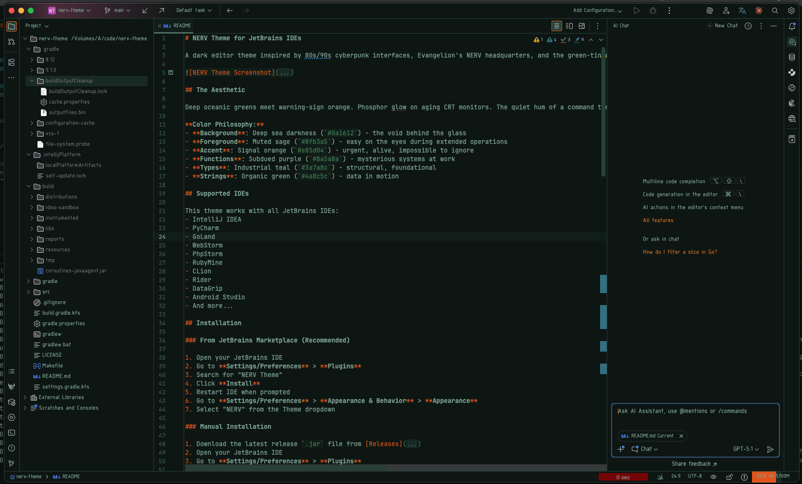

# NERV Theme for JetBrains IDEs

A dark editor theme inspired by 80s/90s cyberpunk interfaces, Evangelion's NERV headquarters, and the green-tinted cinematography of Wong Kar-wai. Industrial control terminals meet the melancholic warmth of *In the Mood for Love*.



## The Aesthetic

Deep oceanic greens meet warning-sign orange. Phosphor glow on aging CRT monitors. The quiet hum of a command terminal in an underground facility. Film grain over midnight corridors.

**Color Philosophy:**
- **Background**: Deep sea darkness (`#0a1612`) - the void behind the glass
- **Foreground**: Muted sage (`#8fb3a5`) - easy on the eyes during extended operations
- **Accent**: Signal orange (`#e85d04`) - urgent, alive, impossible to ignore
- **Functions**: Subdued purple (`#8a5a8a`) - mysterious systems at work
- **Types**: Industrial teal (`#3a7a8c`) - structural, foundational
- **Strings**: Organic green (`#4a8c5c`) - data in motion

## Supported IDEs

This theme works with all JetBrains IDEs:
- IntelliJ IDEA
- PyCharm
- GoLand
- WebStorm
- PhpStorm
- RubyMine
- CLion
- Rider
- DataGrip
- Android Studio
- And more...

## Installation

### From JetBrains Marketplace (Recommended)

1. Open your JetBrains IDE
2. Go to **Settings/Preferences** > **Plugins**
3. Search for "NERV Theme"
4. Click **Install**
5. Restart IDE when prompted
6. Go to **Settings/Preferences** > **Appearance & Behavior** > **Appearance**
7. Select "NERV" from the Theme dropdown

### Manual Installation

1. Download the latest release `.jar` file from [Releases](https://github.com/wongmjane/nerv-theme/releases)
2. Open your JetBrains IDE
3. Go to **Settings/Preferences** > **Plugins**
4. Click the gear icon and select **Install Plugin from Disk...**
5. Select the downloaded `.jar` file
6. Restart IDE when prompted
7. Go to **Settings/Preferences** > **Appearance & Behavior** > **Appearance**
8. Select "NERV" from the Theme dropdown

## Building from Source

### Prerequisites

- JDK 17 or later
- Gradle (or use the included Gradle wrapper)

### Build

```bash
# Clone the repository
git clone https://github.com/wongmjane/nerv-theme.git
cd nerv-theme

# Build the plugin
./gradlew buildPlugin

# The plugin will be in build/distributions/
```

### Run in IDE for Testing

```bash
./gradlew runIde
```

This will launch a sandboxed IDE instance with the theme installed.

## Color Palette

| Role | Hex | Preview |
|------|-----|---------|
| Background | `#0a1612` |  |
| Elevated Surface | `#0f1f1a` |  |
| Highlight | `#1a2e28` |  |
| Foreground | `#8fb3a5` |  |
| Accent | `#e85d04` |  |
| Border | `#2a4a3d` |  |

### Syntax Colors

| Element | Hex | Preview |
|---------|-----|---------|
| Keywords | `#e85d04` |  |
| Strings | `#4a8c5c` |  |
| Numbers | `#d4a017` |  |
| Functions | `#8a5a8a` |  |
| Types | `#3a7a8c` |  |
| Properties | `#c97a4a` |  |
| Comments | `#4a6a5d` |  |
| Constants | `#5a9a8c` |  |

### Diagnostic Colors

| Type | Hex | Preview |
|------|-----|---------|
| Error | `#c92a2a` |  |
| Warning | `#d4a017` |  |
| Info | `#3a7a8c` |  |

### Git Colors

| Type | Hex | Preview |
|------|-----|---------|
| Added | `#4a8c5c` |  |
| Modified | `#d4a017` |  |
| Deleted | `#c92a2a` |  |

## Inspiration

This theme draws from:

- **Neon Genesis Evangelion** - NERV headquarters, MAGI supercomputer terminals
- **80s/90s cyberpunk** - command centers, surveillance systems, industrial control rooms
- **Wong Kar-wai** - the green-tinted melancholy of *In the Mood for Love*, *Chungking Express*
- **CRT phosphor aesthetics** - the glow of late-night terminal sessions

The goal is capturing a *feeling* - the weight of solitude in a darkened room, information flowing across screens, the human operator at the center of vast systems.

## Related

- [NERV Theme for VS Code](https://marketplace.visualstudio.com/items?itemName=wongmjane.nerv-theme)
- [NERV Theme for Zed](https://github.com/wongmjane/nerv-theme)
- [NERV Theme for Neovim](https://github.com/wongmjane/nerv-theme/tree/main/neovim-theme)

## Credits

Created by [Jane Manchun Wong](https://wongmjane.com), ported to JetBrains with [Claude Code](https://claude.ai/code) (Opus 4.5).

Original theme: [github.com/wongmjane/nerv-theme](https://github.com/wongmjane/nerv-theme)

## License

MIT License - See [LICENSE](LICENSE) for details.
